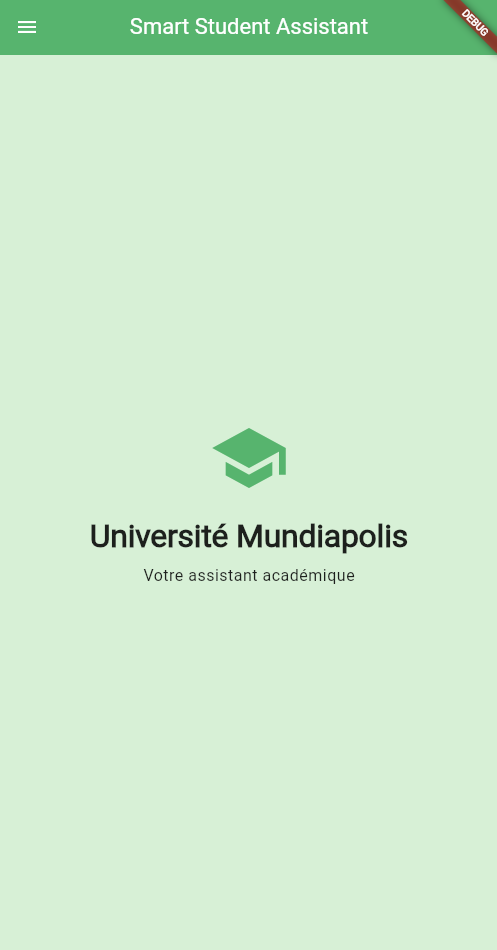
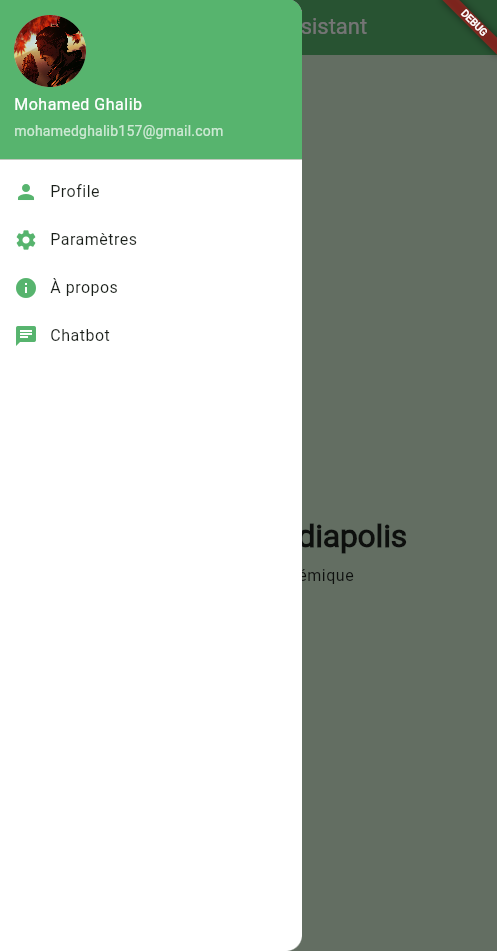
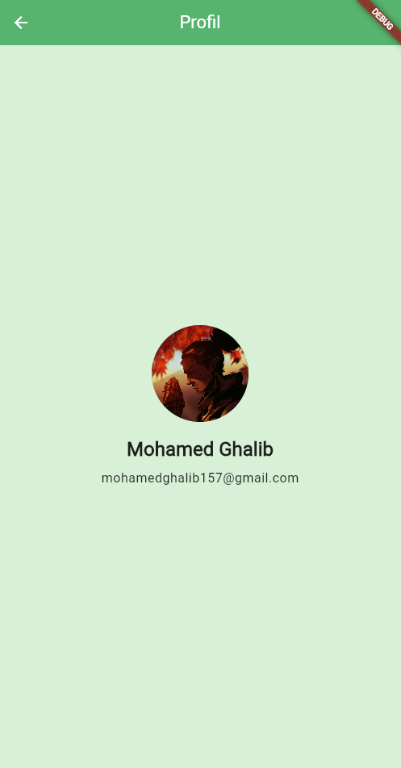
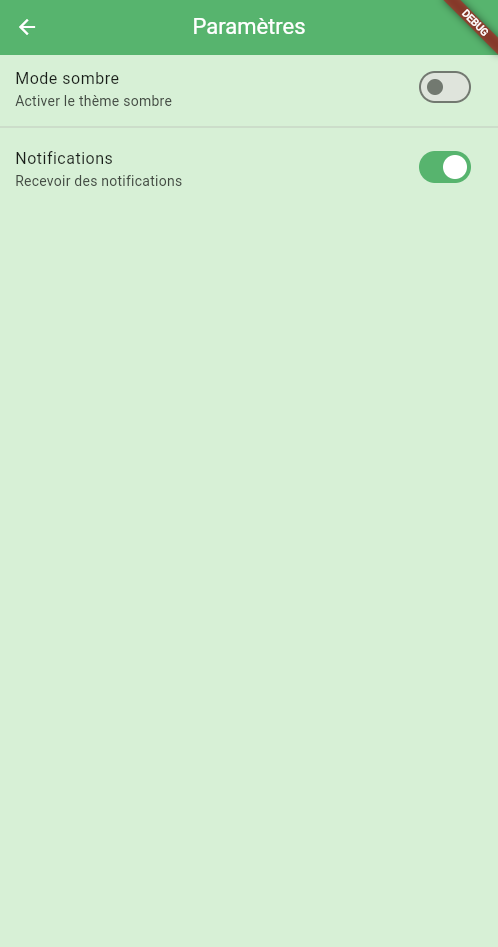
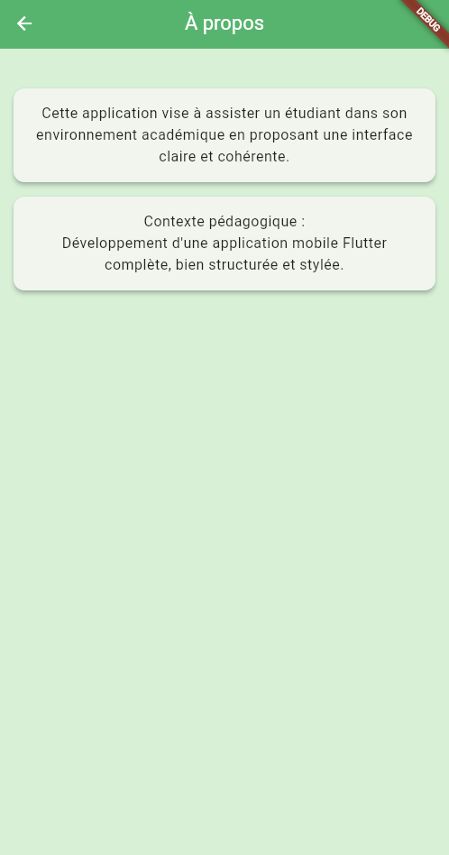
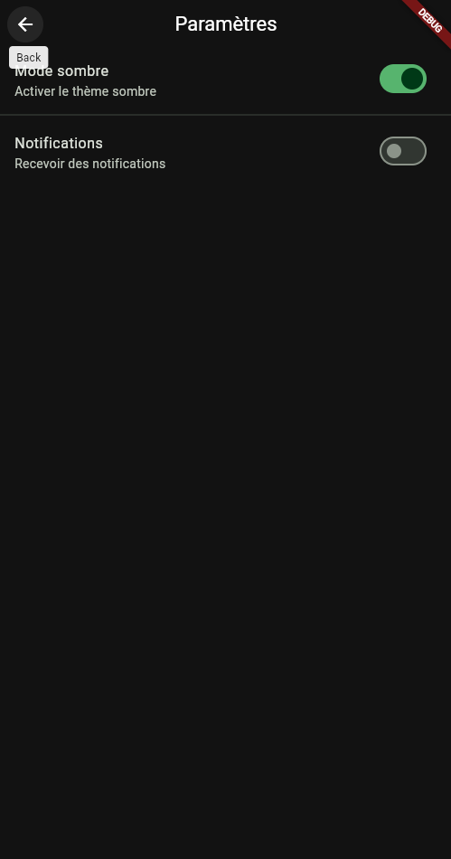
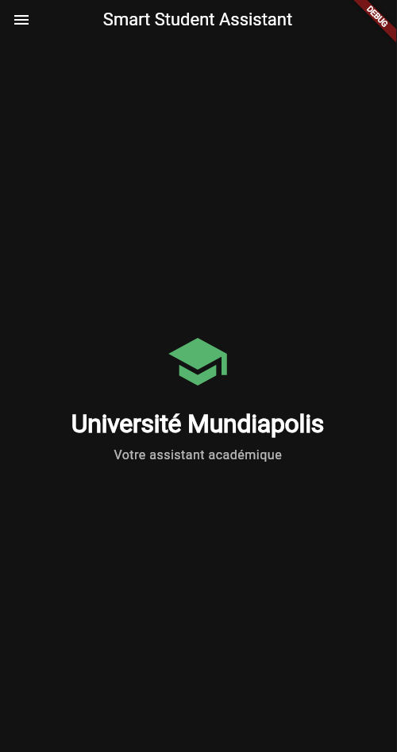
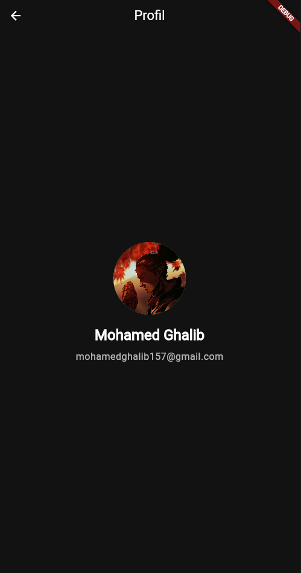
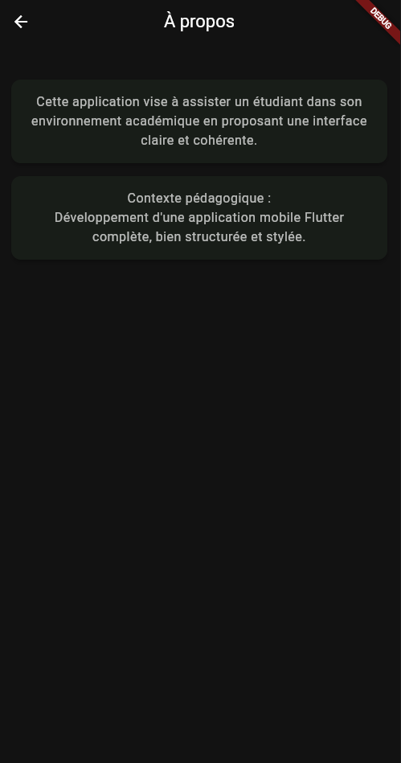
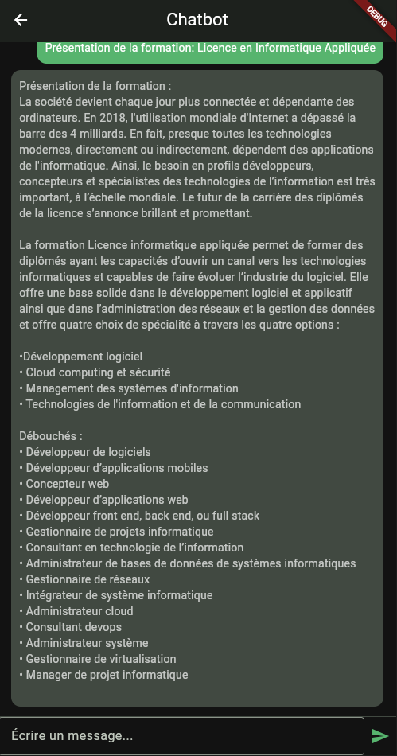

# ds_smart_student_assistant

**Smart Student Assistant** — Application mobile Flutter avec navigation Drawer, thème global, consommation d'API REST avec Retrofit+Dio, et un chatbot simple (sans state management avancé).

## 📋 Description

Cette application vise à assister un étudiant dans son environnement académique en proposant :

- Une interface claire et cohérente
- Une navigation simple via un menu latéral (Drawer)
- Des pages informatives (Accueil, Profil, Paramètres, À propos)
- Un chatbot connecté à une API REST RAG
- Un thème global professionnel avec support du mode clair/sombre
- Gestion d'erreurs personnalisée et user-friendly

## ✨ Fonctionnalités

- **Navigation Drawer** : Menu latéral avec profil utilisateur et navigation vers toutes les pages @lib/widgets/app_drawer.dart
- **Chatbot RAG** : Interface de chat avec gestion d'erreurs personnalisée et appels API via Retrofit @lib/pages/chatbot_page.dart
- **Mode clair/sombre dynamique** : `ValueListenableBuilder` + `ThemeController` pour basculer entre deux thèmes Material @lib/main.dart @lib/theme/app_theme.dart
- **Pages informatives** : Accueil, Profil, Paramètres, et À propos avec design cohérent
- **Thème personnalisé** : Couleurs centralisées dans `AppColors` et appliquées via `AppTheme`

## 📸 Screenshots

<div style="display: flex; flex-wrap: wrap; gap: 10px; justify-content: center;">
  
  
  
  
  
  
  
  
  
  
  
  
</div>

## 🏗️ Architecture applicative

| Couche                    | Description                                                                                        |
| ------------------------- | -------------------------------------------------------------------------------------------------- |
| **UI (pages & widgets)**  | Pages Flutter (lib/pages/) + Drawer (lib/widgets/app_drawer.dart) pour la navigation contextuelle. |
| **Thème**                 | AppTheme expose les thèmes clair/sombre, ThemeController pilote ThemeMode.                         |
| **Services**              | RagApi (Retrofit) + ApiConfig pour la résolution dynamique du backend selon la plateforme.         |
| **Modèles**               | Objets JSON sérialisables RagResponse générés via json_serializable.                               |
| **Backend RAG (externe)** | Point d'entrée `/rag-chat` répond aux requêtes textuelles (non inclus dans ce dépôt).              |

## 📊 Diagramme de séquence (flux chatbot)

```
Utilisateur → ChatbotPage → RagApi → Backend RAG
↓ ↓ ↓
Affiche POST /rag-chat Réponse JSON
réponse {question} {answer}
```

## 🗂️ Structure du projet

ds_smart_student_assistant/

```text
├── lib/
│   ├── main.dart
│   ├── pages/
│   │   ├── home_page.dart
│   │   ├── about_page.dart
│   │   ├── chatbot_page.dart
│   │   ├── profile_page.dart
│   │   └── settings_page.dart
│   ├── services/
│   │   ├── api_config.dart
│   │   ├── chatbot_client.dart (+ .g.dart)
│   │   └── rag_api.dart (+ .g.dart)
│   ├── models/
│   │   ├── chat_request.dart (+ .g.dart)
│   │   ├── chat_response.dart (+ .g.dart)
│   │   ├── rag_response.dart (+ .g.dart)
│   │   └── rag_api.dart (+ .g.dart)
│   ├── theme/
│   │   ├── app_theme.dart
│   │   ├── app_colors.dart
│   │   └── theme_controller.dart
│   └── widgets/
│       └── app_drawer.dart
├── images/
│   ├── sekiro.jpg
│   └── ecole-image.jpg
├── pubspec.yaml
└── README.md
```

## ⚙️ Installation & exécution

### Pré-requis

- Flutter 3.x
- Dart SDK >= 3.4.0
- Un backend RAG exposant l'endpoint `POST /rag-chat` (configuré dans `ApiConfig`)

### Installation

git clone <repository-url>
cd ds_smart_student_assistant

# Installer les dépendances

flutter pub get

# Générer le code (Retrofit + JSON Serializable)

dart run build_runner build --delete-conflicting-outputs### Configuration de l'API

`ApiConfig.baseUrl` ajuste automatiquement l'URL selon la plateforme :

Modifiez l'adresse IP dans `lib/services/api_config.dart` pour pointer vers votre backend.

### Lancement

sh
flutter run## 🧪 Tests

Lancez la suite Flutter par défaut :

flutter test## 📚 Stack technique

- **Flutter** (Material 3)
- **Navigation** : Drawer navigation + `Navigator` classique
- **Réseau** : Dio + Retrofit pour les appels API REST
- **Sérialisation** : Json Serializable & build_runner
- **Thème** : ThemeController avec ValueListenableBuilder (pas de state management externe)
- **Géolocalisation** : Geolocator + Flutter Map + OpenStreetMap (dépendances présentes)

## 🎨 Thème et couleurs

Les couleurs sont centralisées dans `lib/theme/app_colors.dart` :

- **Primary** : `Color.fromRGBO(87, 180, 110, 1)` (Vert)
- **Secondary** : `Color.fromARGB(255, 58, 114, 45)` (Vert foncé)
- **Background** : `Color.fromARGB(255, 215, 240, 214)` (Vert clair)

Le thème supporte les modes clair et sombre, basculables depuis la page Paramètres.

## 🔧 Gestion d'erreurs

Le chatbot inclut une gestion d'erreurs personnalisée avec des messages user-friendly :

- ⏱️ Délai d'attente dépassé
- 🌐 Erreur de connexion
- ⚠️ Erreur serveur
- ❌ Erreurs générales

## 📝 Contraintes techniques respectées

✅ Utilisation de Retrofit avec Dio pour les appels API  
✅ Aucun state management externe (Provider, Bloc, Riverpod, GetX interdits)  
✅ Gestion de l'état avec `setState`, `FutureBuilder`, et `TextEditingController`  
✅ Respect du thème global pour le style  
✅ Aucune couleur codée directement dans les widgets

## 👤 Auteur

**Mohamed Ghalib**  
Email: mohamedghalib157@gmail.com
